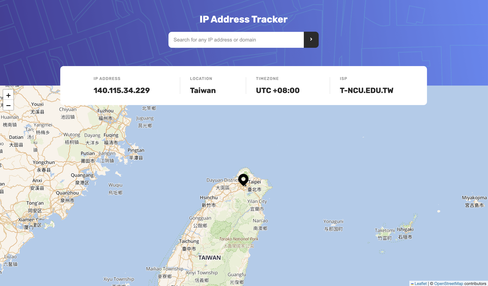

# Frontend Mentor - IP address tracker

This is a solution to the [IP address tracker challenge on Frontend Mentor](https://www.frontendmentor.io/challenges/ip-address-tracker-I8-0yYAH0). Frontend Mentor challenges help you improve your coding skills by building realistic projects.

## Table of contents

- [Overview](#overview)
  - [The challenge](#the-challenge)
  - [Screenshot](#screenshot)
  - [Links](#links)
- [My process](#my-process)
  - [Built with](#built-with)
  - [What I learned](#what-i-learned)
  - [Useful resources](#useful-resources)
- [Author](#author)

## Overview

### The challenge

Users should be able to:

- View the optimal layout for each page depending on their device's screen size
- See hover states for all interactive elements on the page
- See their own IP address on the map on the initial page load
- Search for any IP addresses or domains and see the key information and location

### Screenshot



### Links

- Solution URL: [Solution page on Frontend Mentor](https://www.frontendmentor.io/solutions/ip-address-tracker-f2V3nZmoav)
- Live Site URL: [Live site on Netlify](https://ip-address-tracker-yishin.netlify.app/)

## My process

### Built with

- Desktop-first workflow
- Semantic HTML5 markup
- SCSS - CSS Preprocessor
- [React](https://reactjs.org/) - JS library
- [Leaflet](https://leafletjs.com/) - JS library

### What I learned

- Learned that how to use Leaflet, and how to change the tile layer.

  ```html
  <link rel="stylesheet" href="https://unpkg.com/leaflet/dist/leaflet.css" />
  <link
    rel="stylesheet"
    href="https://unpkg.com/react-leaflet-markercluster/dist/styles.min.css"
  />
  ```

  ```js
  <MapContainer
    className="map"
    center={position}
    zoom={8}
    scrollWheelZoom={true}
    key={`${locData}`}
  >
    <TileLayer
      attribution='&copy; <a href="https://www.openstreetmap.org/copyright">OpenStreetMap</a> contributors'
      url="https://tiles.stadiamaps.com/tiles/outdoors/{z}/{x}/{y}{r}.png"
    />
    <Marker position={position}></Marker>
  </MapContainer>
  ```

### Useful resources

- [React Icons](https://react-icons.github.io/react-icons) - It is a very useful package. I can add tons of icons by just importing it, very convenient and efficient.
- [How to pin the location with custom icon correctly](https://stackoverflow.com/questions/46101450/explanation-of-leaflet-custom-icon-latlng-vs-xy-coordinates)

## Author

- Website - [Yi-Shin Jheng](https://github.com/Yishin-Jheng)
- Frontend Mentor - [@Yishin-Jheng](https://www.frontendmentor.io/profile/Yishin-Jheng)
